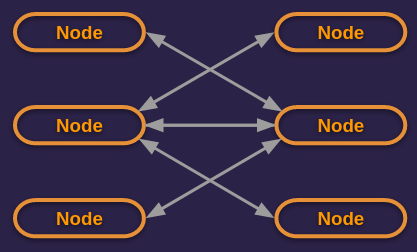

# Generic COMM Module for Go

The aim of this module is to provide a simple, yet performant API for 
sending and receiving data over a network.  It provides a consistent interface 
for managing connections and reading/writing data in a variety of use cases 
and can easily be extended to support more.

### Primary features:
* Generic, thread-safe API with support for **TCP/UDP** (Ethernet/Wi-Fi) 
  and **RFCOMM** (Bluetooth) based communication. 
* **Client API** - Establish a connection with a local 
  service or server on the network to post a request, download data, etc.
* **Server API** - Simultaneously receive data from multiple clients, host a web 
application, serve files over the LAN, etc.
* **Node API** - Easily send and receive messages to other nodes over the 
  network*, letting the API handle the raw socket IO stream, 
serializing/deserializing the messages, etc, which can contain a payload of any 
type, up to ~4 GB in size.

<sub>*Only TCP is supported.</sub>

This module relies on the popular Go modules `net` (for TCP/UDP) and `golang.org/x/sys/unix` 
(for RFCOMM).

## Prerequisites

* RFCOMM is only supported on Linux (BlueZ stack) at this time.
* Install BlueZ on Debian/Ubuntu via: `apt install bluetooth libbluetooth-dev bluez bluez-tools`
* Go, version 1.19+.

## Supported Protocols

|            | TCP | UDP | RFCOMM |
|------------|:---:|:---:|:------:|
| Client API |  ✅  |  ✅  |   ✅    |
| Server API |  ✅  |  ✅  |   ✅    |
| Node API   |  ✅  |  ❌  |   ❌    |


The actual network adapter that is used for communication depends on a few factors.
The first is whether you are using TCP/UDP or RFCOMM; if the former then it will 
use your Ethernet (IEEE 802.3) or Wi-Fi (IEEE 802.11) adapter; if the latter then 
it will use your Bluetooth (IEEE 802.15) adapter. 

If using TCP/UDP and your device supports both Ethernet and Wi-Fi, then it will 
use the adapter that has an Internet connection.  If both adapters have an Internet
connection then it will default to using Ethernet.

If you have multiple Bluetooth adapters, or you wish to specifically bind to Ethernet
vs Wi-Fi (or vice-versa), then specify an assigned address rather than use a loopback
address like `127.0.0.1`, `0.0.0.0`, or `00:00:00:00:00:00`.

In order to use UDP when using the Client or Server APIs, specify `true` for the
`connectionless` parameter when getting a new instance of `Config`.

## API Overview

The three APIs described below are defined in their own respective packages 
and in many cases you will only need to import a single package to meet the needs 
of your application/service.  One exception to that is if you need to catch a 
specific `error` that `comm` defines, then you would have to also import the 
`comerr` package (which, as a convenience, wraps some common functions defined 
in the official `errors` package so that you don't have to also import that one).

Because this module/library is meant to be used internally (within the 
company), it exports/exposes only what is needed so that the public 
interface and global space is clean, intuitive, and tailored to our 
specific needs.  Of course since we own the repo, we can always move 
`internal` packages to `pkg` or export types/funcs when needed, etc.

### Client API
```go
import "tonysoft.com/comm/pkg/client"
```

The **Client API** is used to establish a network connection with another device
that is listening/ready for such communications to occur (i.e., the device is a 
"server" of some sort), after which the client can send data to or receive data
from the other device.  This communication normally happens in a request/reply 
fashion, with the client sending requests, receiving replies, and closing the 
connection when done.  Full-duplex communication on separate Go routines is
supported and thread-safe.

An example use case would be connecting to an EEG headset, sending the "start 
acquisition" command and subsequently receiving samples until the command to stop
is sent. Another example is using it to download a file from the Internet.  


Example of making an HTTP GET request:
```go
// Error checking and proper buffering 
// of received data omitted for brevity

const domain = "www.company.com"
const resource = "/"

ips, _ := net.LookupIP(domain)
ip := ips[0]

cfg := client.NewConfig(ip.String(), 80)
c, _ := client.New(cfg)

c.Start()
defer c.Stop()

request := []byte(fmt.Sprintf("GET %s HTTP/1.1\r\nHost: %s\r\n\r\n", resource, domain))
c.Write(request)

time.Sleep(time.Second)

buffer := make([]byte, 10000000)
readCount, _ := c.Read(buffer)

fmt.Printf("response:\n%s\n", string(buffer[:readCount]))
```

Notice that the first action in the example above (besides defining a couple 
constants) is to resolve the FQDN "www.company.com" to an IP address.  This is 
necessary because the API expects to be passed an IP or MAC address. If it's passed 
an IP address, it knows to use TCP/UDP (Ethernet/Wi-Fi); if it's passed a MAC address, 
it knows to use RFCOMM (Bluetooth).  A DNS query is a relatively expensive operation 
that the API does not want to impose on its consumers, particularly if a standard 
library already provides this functionality.

With all three of the `comm` APIs described here, you will need to use an instance
of `Config` to get a new instance of `Client` | `Server` | `Node`.  All of these
types are interfaces, with concrete implementations for each supported transport
protocol (TCP, RFCOMM, etc).

### Server API
```go
import "tonysoft.com/comm/pkg/server"
```

The **Server API** is used to bind the application to a socket, accept client
connections on that socket, and handle IO with each client connection 
simultaneously.  Unlike an instance of `Client`, an instance of `Server` cannot
make outgoing calls...its purpose is only to accept calls from clients, however
once a client connection has been established the server can push data at will, 
as like with the `Client` interface, full-duplex communication is supported.

An example use case would be running an EEG headset emulator that supports Bluetooth
for a more realistic over-the-air test and Ethernet for when running automated tests
locally, etc. With the **Server API**, both of those circumstances would be supported 
out-of-the-box without concern to the underlying transport mechanism.


Example of a simple echo server:
```go
// Error checking and proper buffering 
// of received data omitted for brevity

cfg := server.NewConfig(net.IPv4zero.String(), 9001)
s, _ := server.New(cfg)

go func() {
    for clientConn := range s.Accept() {
        go func(c server.Connection) {
            buffer := make([]byte, 1024)
            for {
                count, e := c.Read(buffer) // wait for data up to cfg.ReadTimeoutUs microseconds
                if e != nil { return }
                if count == 0 { continue }
                c.Write(buffer[:count])
            }   
        }(clientConn)
    }
}

s.Start()
defer s.Stop()

time.Sleep(10 * time.Second) // run the echo server for a time
```

Unlike the **Client API**, here you would specify the local socket to which the
server should bind.  A socket address is the combination of IP address and port 
number, if using TCP/UDP; or it's the combination of MAC address and port if
using RFCOMM (with the port number technically referred to as the "channel" and
accepts values between 1 and 30, unlike a TCP/UDP port, which accepts values
between 1 and 65535, though ports up to 1024 usually require root privileges to
bind to as they are used by common services).  Often the combination of address/host
and port are collectively referred to as the "address."

If the server can bind to any available Ethernet/Wi-Fi address (preferably one
with an active Internet connection), then for TCP/UDP you can specify `0.0.0.0` 
and the system will bind to the best interface for you.  Likewise, if communicating 
over Bluetooth, specify `00:00:00:00:00:00` for the same effect.  

### Node API
```go
import "tonysoft.com/comm/pkg/node"
```

The **Node API** is built on top of the Client and Server APIs, providing a means
of both making and receiving calls using a single interface.  Furthermore, it hides
the complexity of reading from the socket, parsing the incoming byte stream to form 
packets, deserializing packets into objects; and the inverse, where objects are 
serialized into a particular packet structure before being sent over the network, 
etc. Note it's assumed the caller and the callee are both using the **Node API**.

As opposed to the other two APIs, the **Node API** wraps the data you send inside
what it refers to as "messages," which are of the type `Message[T any]`, with `T` 
being the type of the message's payload (your data).  For example, if you simply 
want to send strings to other nodes, you would be working with instances of 
`Message[string]`. If you have a defined structure to use, then it would be 
instances of `Message[YourStruct]`, etc. You can also use `Message[[]byte]`, which 
is particularly useful if you do not want the **Node API** to serialize the data 
(which it does via `json.Marshal()`), perhaps because you require a more efficient
approach than JSON (do note that the payload is still base-64 encoded to ensure
reliable parsing of packets).  If the message does not have a payload, it would 
be `Message[any]`.

A message is not something you create explicitly.  Instead, you first create an 
instance of `Node[T any]`, where `T` is the type of the message's payload, and when
you invoke `Send()` on the node instance it will return a reference to the message
that was sent.  If the callee node is configured to send receipts (on by default), 
then it will send a receipt to the caller to confirm it received the message and
in full (if there was a payload included).  The caller can listen for these receipts
by reading messages off the channel returned by `Status()`.  These messages, or
receipts, also have a `Status()` method that returns an instance of `MessageStatus`.
If in fact the message and payload were received in full (which may require several
transport-level packets to be sent "over the wire"), `MessageStatus` will equal 
`MessageReceived`, otherwise if the payload did not come through fully it will equal 
`PayloadNotReceived`.



Example of two nodes playing ping pong:
```go
// Error and message status checking
// omitted for brevity

ping := "ping"
pong := "pong"

cfg1 := node.NewConfig(":9001")
cfg2 := node.NewConfig(":9002")

n1, _ := node.New[string](cfg1)
n2, _ := node.New[string](cfg2)

n1.Start()
defer n1.Stop()
n2.Start()
defer n2.Stop()

n1.Send(n2.Config().Address, &ping)

time.Sleep(100 * time.Millisecond)

msg := <-n2.Recv()
if *msg.Data == ping {
    fmt.Println("ping received!")
    n2.Send(n1.Config().Address, &pong)
    time.Sleep(100 * time.Millisecond)
}

msg = <-n1.Recv()
if *msg.Data == pong {
    fmt.Println("pong received!")
}
```

As you can see from the example, the `Data` property contains a pointer to `T`, 
so for `string` comparison dereferencing is required.  Dereferencing will likely
be required if `T` is of the type `[]byte`, but it simply depends on how `Data`
is used.

You may have also noticed that unlike the Client/Server APIs, the `NewConfig()` 
function expects the socket address, port included, to be passed in as a single
parameter and that the IP address portion has been omitted (but the colon that 
normally separates the two is kept).  That implies any available address can be
used.  

For interprocess communication on the same computer, it's more performant to use a 
loopback address versus an assigned address of a physical network interface, that 
way the loopback adapter is used and traversal of the full network stack is avoided.

## Configuration

All three APIs offer various configuration options, which you can learn by reviewing
the packages contained in `internal/config`.  Configuration is done by first getting
an instance of `Config` as shown in the examples above, then by changing the properties
on the `Config` instance.  When getting a new instance of `Client`, `Server`, or
`Node`, this `Config` instance is passed to the `New()` method and the returned
object comes pre-configured.  However, you can also call `SetConfig()` on `Client`,
`Server`, or `Node` to change the configuration at any time.  Just note that 
stopping/disconnecting and starting/connecting once again may be necessary for 
the new `Config` to fully take effect.

## Error Handling

While the `Client` interface has `Read()` and `Write()` functions that return
an error, the `Server` and `Node` interfaces have an `Errors()` channel that 
produces server/node-level errors as well as propagating connection-level errors.  

Errors sent through that channel may be ones defined by `comm` and if you need to
handle those errors specifically, you can do so as shown below:
```go
import "tonysoft.com/comm/pkg/comerr"
```
```go
for err := range s.Errors() {
    if comerr.Is(err, comerr.ErrConnectionLimitReached) {
        // do something 
    }
}
```

## Testing

For regression testing or reviewing more example usage, please see the automated 
tests defined in the `tests` folder as well as the binary executables defined in 
the `cmd` folder.  Because RFCOMM/Bluetooth tests will likely need to be performed 
using two different devices, those are written as programs meant to be manually ran 
and observed.  
